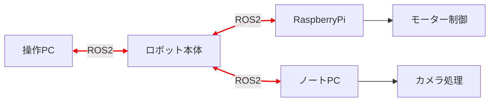

# What is ROS2? 🤖

::: info 📖 このページで行うこと
ROS2の概要をざっくり説明します。
:::

## 📌 ROS2とはなにか

::: info 📖 公式の定義
> The Robot Operating System (ROS) is a set of software libraries and tools that help you build robot applications. From drivers to state-of-the-art algorithms, and with powerful developer tools, ROS has what you need for your next robotics project. And it's all open source.
:::

これはROS2公式の解説です。ちょっと難しいですね。

::: tip 💡 わかりやすく言うと...
OSとは名ばかりで、「**ロボット用の通信フレームワークと便利なライブラリの集まり**」と考えてもらって結構です。
:::

### ROS2の主な特徴

| 特徴 | 説明 |
|------|------|
| 🔗 **分散システム** | 複数のコンピュータ間で簡単に通信可能 |
| 📦 **豊富なライブラリ** | センサー制御から経路計画まで幅広くカバー |
| 🌐 **オープンソース** | 無料で利用・改変可能 |
| 🛡️ **リアルタイム対応** | 産業用ロボットにも使える信頼性 |

ROS2の強みは、抽象化されたフレームワークで、**かんたんにロボットの制御システムを構築できる**ところにあります。

---

## 🎯 どんなときに使うのか

主にロボットを制作するとき、特に**複数のコンピュータを接続してそれぞれを通信させたい場合**に効果を発揮します。

::: details 🏆 2025年度ロボット「紫峰」の例
2025年度のロボット「紫峰」を見てわかるように、大会当時のロボットには **RaspberryPi4B** と **ノートPC1台** が搭載されていました。

「紫峰」の詳細な制御プロセスは後述しますが、操作室から**有線LAN1本のみ**で通信を行っており、カメラ映像の受信から制御信号の送信までを1本で行いました。
:::

### ROS2が解決してくれること

#### 特徴

- ✅ **通信の抽象化** - TCP/IPの実装を気にしなくてOK
- ✅ **ライブラリ提供** - 制御工学の式を一から実装しなくてOK
- ✅ **モジュール化** - 各機能を独立して開発・テスト可能

#### 具体例

このグラフの赤い線がROS2の通信を表しています。

それぞれのコンピュータの橋渡しをし、またモータのループ制御やカメラ映像の転送などのライブラリを提供してくれるのがROS2というわけです。

---

## 🛠️ どのように使うのか

まず、ROS2は**Ubuntu**と呼ばれるOSの上で動かすことが基本です。

::: warning ⚠️ 注意：OSの選択について
WindowsやMacで動作するROS2は**公式にサポートされておらず**、コミュニティによって運営されているため、避けるべきです。
:::

::: tip 💡 推奨環境
DockerやWSL等の仮想環境でも開発が可能ですが、GUIでロボットの情報を見たりすることも多いので、**Ubuntuをネイティブにインストール**して使用することをおすすめします。

詳しくは[Ubuntuセットアップ](./ubuntu_setup.md)の章で解説します。
:::

### バージョンの選び方

ROS2のバージョンにはいくつか種類があり、**LTSバージョン**を使うことを強くおすすめします。

| ROS2 バージョン | 対応 Ubuntu | サポート期限 | 推奨度 |
|----------------|-------------|-------------|--------|
| **Humble Hawksbill** | 22.04 LTS | 2027年5月 | ⭐⭐⭐ (本ドキュメントで使用) |
| **Jazzy Jalisco** | 24.04 LTS | 2029年5月 | ⭐⭐⭐ |

2025年度ロボット「紫峰」では、安定性を重視して **ROS2 Humble Hawksbill** を採用しました。そのため、本ドキュメントでも **Humble** をベースに解説を進めます。

現在は後継のLTSである **Jazzy Jalisco** もリリースされています。Ubuntu 24.04 を使用する場合や、最新の機能に触れたい場合は、Jazzy への移行も視野に入れてみてください。

::: danger 🚨 インストール時の注意
各バージョンには**対応しているUbuntuのバージョン**があります。インストールする際には十分注意してください。

例：ROS2 Humble は Ubuntu 22.04 まで対応
:::

::: warning ⚠️ Raspberry Pi 5 の購入を検討している場合
**Raspberry Pi 5 では Ubuntu 22.04 が動作しません**。そのため、ROS2 Humble を Raspberry Pi 5 上で動かすことはできません。

Raspberry Pi 5 を使用する場合は、**Ubuntu 24.04** と **ROS2 Jazzy Jalisco** の組み合わせを選択してください。

なお、紫峰で使用したRaspberry Pi 4B 以前のモデルでは Ubuntu 22.04 が動作するため、Humble を使用できます。
:::

---

## 🚀 次のステップ

- 📥 [Ubuntuのセットアップ](./ubuntu_setup.md) - 開発環境を整えよう
- ⚙️ [ROS2のセットアップ](./ros2_setup.md) - ROS2をインストールしよう

---

## 📚 More

公式ドキュメントでさらに詳しく学ぶことができます：

- 🌐 [ROS公式サイト](https://www.ros.org/)
- 📖 [ROS2ドキュメント](https://docs.ros.org/en/rolling/)
- 🎓 [ROS2チュートリアル](https://docs.ros.org/en/rolling/Tutorials.html)
