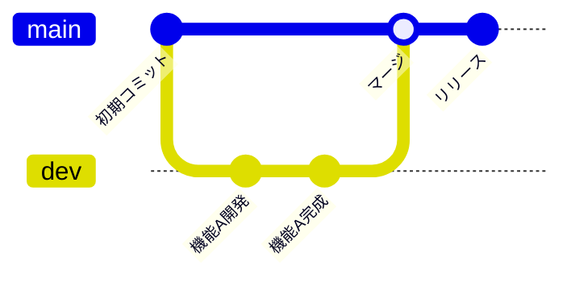
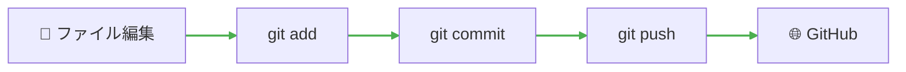

<!-- Copyright 2026 Keita Sekiguchi

Licensed under the Apache License, Version 2.0 (the "License");
you may not use this file except in compliance with the License.
You may obtain a copy of the License at

    http://apache.org

Unless required by applicable law or agreed to in writing, software
distributed under the License is distributed on an "AS IS" BASIS,
WITHOUT WARRANTIES OR CONDITIONS OF ANY KIND, either express or implied.
See the License for the specific language governing permissions and
limitations under the License. -->

# What is GitHub? 🐙

::: info 📖 このページで行うこと
Git/GitHubの概要をざっくり説明します。
:::


## 📌 Git/GitHubとはなにか

### こんな経験はありませんか？

「どれが最新のドキュメントかわからない...」

コーディングの世界でも、バージョン管理は非常に重要な問題です。この解決策の一つが、**GitとGitHubによる分散型バージョン管理**です。

### Gitとは

::: info 📖 公式の定義
> **Git**（ギット）は、プログラムのソースコードなどの変更履歴を記録・追跡するための**分散型バージョン管理システム**である。
:::

::: tip 💡 わかりやすく言うと...
「**変更履歴の倉庫**」と考えてもらって結構です。いつ、誰が、どこを変更したかを全て記録してくれます。
:::

### GitHubとは

::: info 📖 GitHubの特徴
- 世界中の人々がコードを保存・公開できる**ソースコード管理ツール**
- Gitを使ったコード専用の有能なGoogleDriveのようなもの
- 個人開発はもちろん、**共同開発で重宝**することになります
:::

| 特徴               | 説明                           |
| ------------------ | ------------------------------ |
| 🌐 **コード共有**   | 世界中の人々とコードを共有可能 |
| 👥 **共同開発**     | チームでの開発をスムーズに     |
| 📜 **履歴管理**     | 全ての変更履歴を追跡           |
| 🔄 **バックアップ** | クラウド上にコードを安全に保存 |

::: details 🔍 ライバルツール
GitHubの他にも同様のサービスがあります：
- **GitLab** - セルフホスト可能なGitプラットフォーム
- **Bitbucket** - Atlassian社のGitサービス
- **tracpath** - 日本製のGitサービス
:::

---

## 🎯 主なGitの用語

Git/GitHubを使う上で、いくつかの用語を覚えておく必要があります。

### リポジトリ (Repository)

::: info 📖 リポジトリとは
- 履歴管理を行う場所
- GitHub側とPC側に存在する、フォルダのようなもの
- プロジェクトごとに作成されることが多い
:::

| 種類                     | 説明                               |
| ------------------------ | ---------------------------------- |
| 🌐 **リモートリポジトリ** | サーバー（GitHub）にあるリポジトリ |
| 💻 **ローカルリポジトリ** | 自分のPCにあるリポジトリ           |

### コミット (Commit)

::: tip 💡 コミットとは
- インデックスに登録してある変更対象をローカルリポジトリに反映すること
- **変更履歴**を登録すること、又は変更履歴自体を指す
- 「セーブポイント」のようなイメージ
:::

### ブランチ (Branch)

::: tip 💡 ブランチとは
- 履歴管理を枝分かれさせたもの
- 複数の履歴を並列に管理できる
- 同時並行で異なる部分を編集する際に用いられる
:::



### マージ (Merge)

::: info 📖 マージとは
- 異なるブランチ（枝）の変更を反映させること
- 互いの変更履歴が残る
:::

### コンフリクト (Conflict)

::: warning ⚠️ コンフリクトとは
- 単語の意味は「紛争, 衝突」
- 違う枝同士で**同じところを編集してしまったとき**に起こる
- Gitが困っちゃう（どちらを反映させればいいかわからない）
- 手動で解決する必要がある
:::

### プルリクエスト (Pull Request)

::: tip 💡 プルリクエストとは
開発者のローカルリポジトリでの変更を他の開発者に通知する機能です：
- ✅ 機能追加や改修など、作業内容をレビュー・マージ担当者に通知
- ✅ ソースコードの変更箇所をわかりやすく表示
- ✅ ソースコードに関するコミュニケーションの場を提供
:::

---

## 🛠️ 主なGitコマンド

Gitを操作する際に使用する主なコマンドを紹介します。

### 基本コマンド

| コマンド                    | 説明                                                     |
| --------------------------- | -------------------------------------------------------- |
| `git init`                  | 新しいリポジトリを作成する                               |
| `git clone <url>`           | リモートリポジトリをローカルにクローンする               |
| `git add <file>`            | ファイルをステージングエリアに追加する                   |
| `git commit -m "<message>"` | ステージングエリアの変更をコミットする                   |
| `git push`                  | ローカルのコミットをリモートリポジトリにプッシュする     |
| `git pull`                  | リモートリポジトリから変更を取得し、ローカルにマージする |

### ブランチ操作

| コマンド                | 説明                                         |
| ----------------------- | -------------------------------------------- |
| `git branch`            | ローカルブランチの一覧を表示する             |
| `git branch <name>`     | 新しいブランチを作成する                     |
| `git checkout <branch>` | 指定したブランチに移動する                   |
| `git merge <branch>`    | 指定したブランチを現在のブランチにマージする |

### 状態確認

| コマンド     | 説明                     |
| ------------ | ------------------------ |
| `git status` | ファイルの状態を表示する |
| `git log`    | コミット履歴を表示する   |
| `git diff`   | 変更内容を表示する       |

---

## 🔄 基本的なワークフロー

Git/GitHubを使った開発の基本的な流れを説明します。



### ステップ1: リポジトリの作成/クローン

新しいプロジェクトを始める場合：
```bash
git init
```

既存のリポジトリをコピーする場合：
```bash
git clone <リポジトリURL>
```

### ステップ2: 変更をステージングに追加

```bash
git add <ファイル名>    # 特定のファイルを追加
git add .              # 全ての変更を追加
```

### ステップ3: コミット

```bash
git commit -m "変更内容の説明"
```

::: tip 💡 コミットメッセージのコツ
- 何を変更したかを簡潔に記述
- 日本語でも英語でもOK
- 例：「ログイン機能を追加」「バグ修正: ボタンが押せない問題」
:::

### ステップ4: プッシュ

```bash
git push origin main
```

---

## 🚀 次のステップ

::: tip 🔧 準備中
次のステップのドキュメントは現在作成中です：

- 🔧 **Gitのセットアップ** - Gitをインストールしよう
- 📝 **GitHubハンズオン** - 実際に操作してみよう

完成までしばらくお待ちください！
:::

---

## 📚 More

公式ドキュメントやおすすめサイトでさらに詳しく学ぶことができます：

- 🐒 [サル先生のGit入門](https://backlog.com/ja/git-tutorial/) - 非常にわかりやすいGitチュートリアル
- 🌐 [GitHub公式ドキュメント](https://docs.github.com/ja) - GitHub公式の日本語ドキュメント
- 📖 [Gitインストール手順（Windows向け）](https://sukkiri.jp/technologies/devtools/git/git_win.html) - Windowsでのインストール方法
- 💡 [実務で初のgit push](https://qiita.com/shimotaroo/items/ed08d76447144d566637) - 実践的な使い方まとめ
